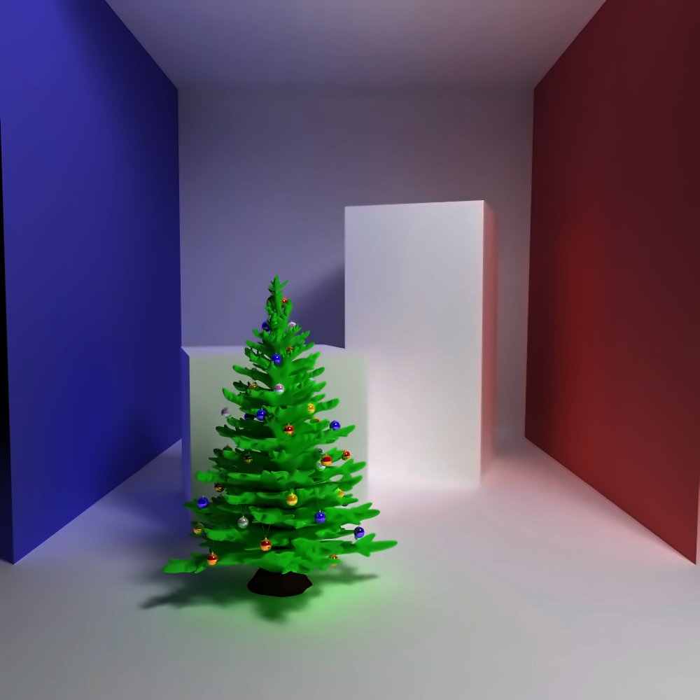
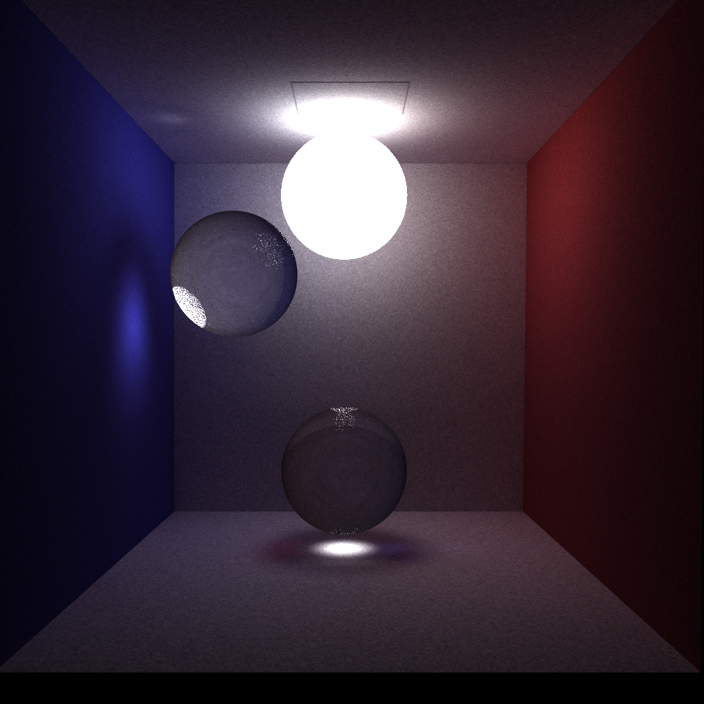
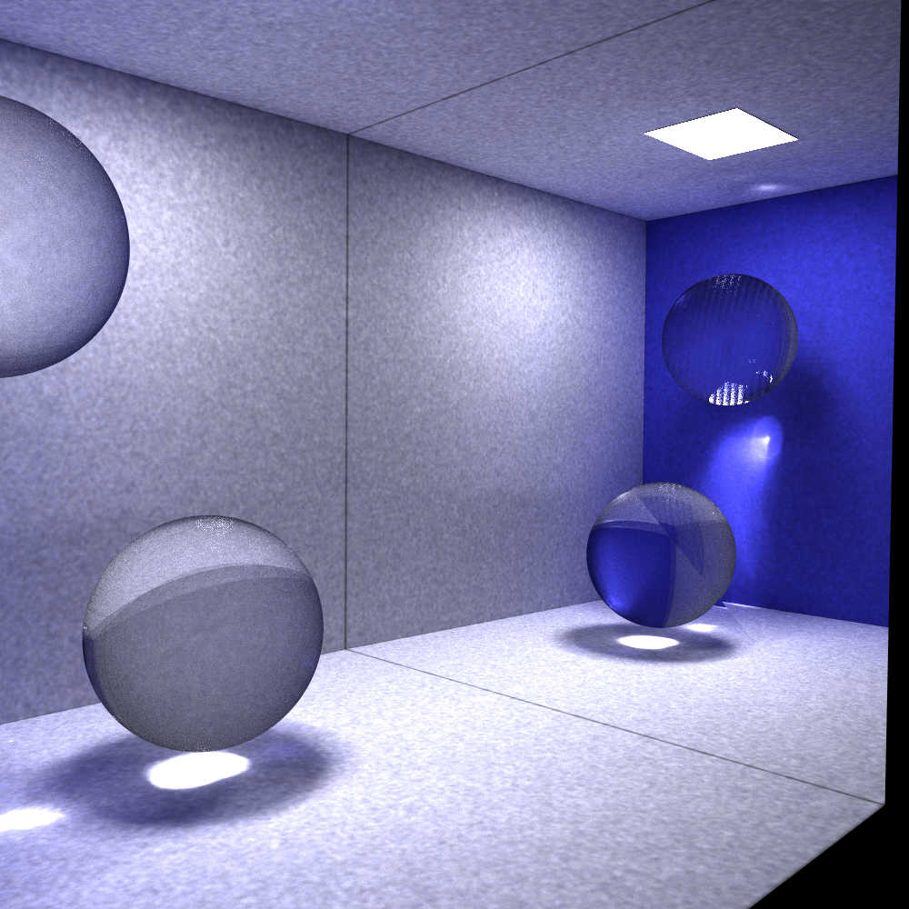
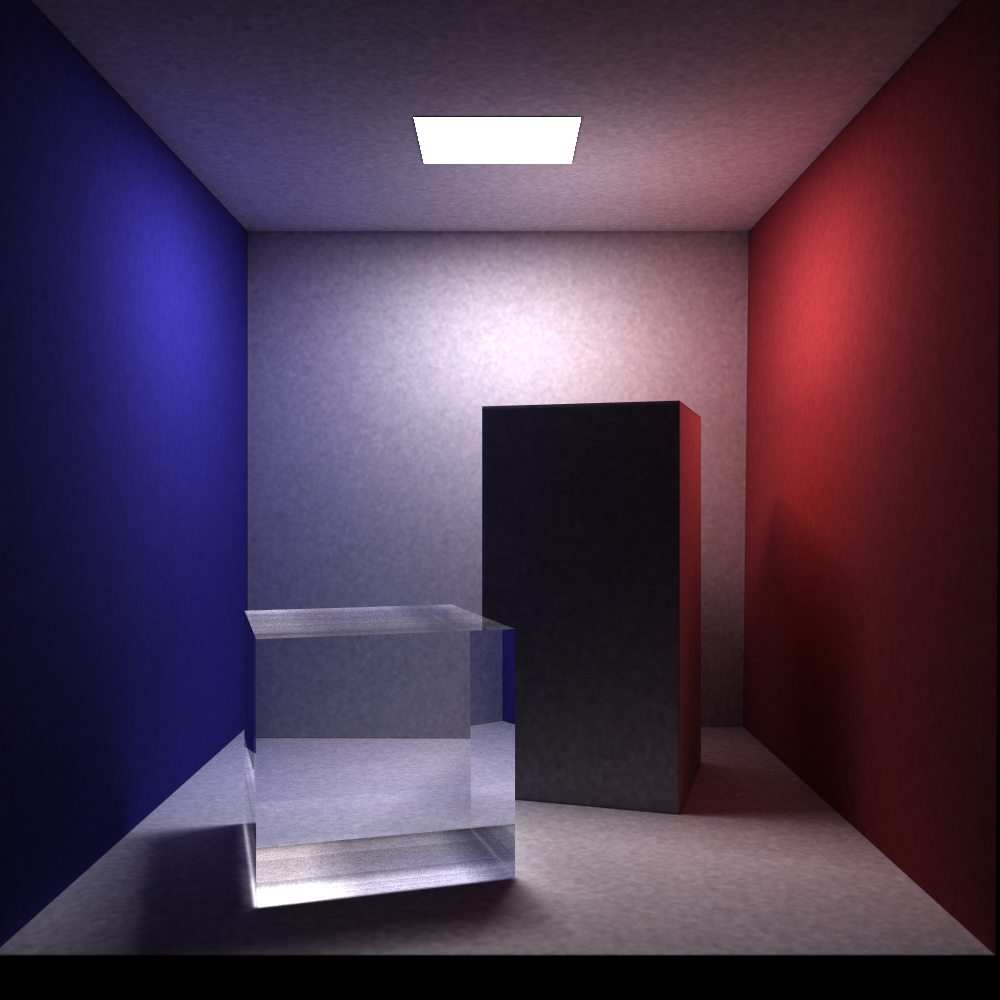

# Miyuki Renderer

This is a hobby project as I learn pbrt. (see http://pbrt.org)

Inspired by https://github.com/JamesGriffin/Path-Tracer, 	https://github.com/fogleman/pt

图形学上不会再开新坑了，这是最后一个项目（只是可能会有点大）。如果我够无聊会把我的脚本引擎给整合进来来处理场景文件(现在是用的十分钟撸的XML parser)

##  Features:

It is currently using path tracing, photon mapping (https://graphics.stanford.edu/courses/cs348b-00/course8.pdf)., and sppm. I chose BVH as acceleration structure, with naive split strategy.

It loads .obj files using tiny_obj_loader (the same as my previous projects).

It uses SIMD instructions to intersect multiple triangles at once, resulting in roughly 30%-50% speed boost.

A non-local means filter is used as denoiser (using opencv)

## TODO List:

1. ~~Path tracing with next event estimation~~
2. ~~Photon mapping~~
3. ~~sppm  (Stochastic Progressive Photon Mapping)~~ (see https://www.ci.i.u-tokyo.ac.jp/~hachisuka/ppm.pdf and https://www.ci.i.u-tokyo.ac.jp/~hachisuka/sppm.pdf)
4.  Bidirectional path tracing
5.  Metropolis Light Transport
6. Loading model files using GUI
7. Physically based reflection models
8. Better sampler
9. Texture
10. Volumetric
11. Participating media
12. Spectrum
13. Depth of field
14. Refactoring (the GUI module is rubbish)
15. Non-local means filter (I wrote one but it doesn't work)

## Gallery

These are rendered with path tracing with a denoiser.

These are rendered with sppm. (ignore those artifacts due to single precisions)

